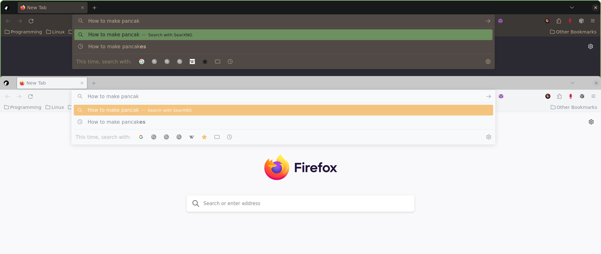

# ❄️ nix-colors-adapters

> **Configure theme of all your apps with a single line**

Collection of adapters for automatically applying [nix-colors](https://github.com/Misterio77/nix-colors) `base16` schemes.



Code for this example:

```diff
- colorScheme = inputs.nix-colors.colorSchemes.gruvbox-dark-hard;
+ colorScheme = inputs.nix-colors.colorSchemes.ayu-light;
```

## Adapters

| Adapter              | Accent | Notes                                                                      |
| -------------------- | ------ | -------------------------------------------------------------------------- |
| Adwaita (GTK3, GTK4) | 🟢      | sets GTK3 theme to `adw-gtk3`                                              |
| Alacritty            | 🔴      |                                                                            |
| dunst                | 🟠      |                                                                            |
| ✨Firefox✨            | 🟢      | depends on Adwaita                                                         |
| GTK2                 | 🟠      |                                                                            |
| Kvantum              | 🟠      | Kvantum is problematic, consider disabling it if you encounter broken apps |
| Rofi                 | 🔴      |                                                                            |
| swaylock             | 🟠      |                                                                            |
| Wezterm              | 🔴      |                                                                            |


(🟢 supported, 🟠 possible, 🔴 impossible)

## Install (system flake + system home-manager)

1. configure home-manager, make sure to pass `inputs` to your home module ([vimjoyer tutorial](https://www.youtube.com/watch?v=FcC2dzecovw))
2. add `nix-colors` and `nix-colors-adapters` to you `inputs` in `flake.nix`:
```
inputs = {
    ...
    nix-colors.url = "github:misterio77/nix-colors";
    nix-colors-adapters.url = "gitlab:vfosnar/nix-colors-adapters";
    ...
};
```
3. import them in your home module `home.nix`:
```
imports = [
    ...
    inputs.nix-colors.homeManagerModules.default
    inputs.nix-colors-adapters.homeManagerModules.default
    ...
];
```
4. you're done!

## Configuration (home.nix)

You can configure any `base16` theme using [nix-colors](https://github.com/Misterio77/nix-colors).

To configure `nix-colors` with Gruvbox Dark Hard:
```nix
colorScheme = inputs.nix-colors.colorSchemes.gruvbox-dark-hard;
```

### Enable/disable adapter

All adapters are enabled by default. To disable an adapter set `nixColorsAdapters.<adapter>.enable = false;`. For example to disable the `rofi` adapter so you can manage its theme manually:
```
nixColorsAdapters = {
    rofi.enable = false;
};
```

### Configure Firefox
For Firefox to work you need to specify a list of profile names. The configuration will only apply on these profiles.
```
nixColorsAdapters = {
    firefox.profiles = [ "alice", "bob" ];
};
```

### Configure Wezterm
Themes for Wezterm cannot be applied automatically so you have to run the following in your wezterm.lua:
```lua
config.colors = wezterm.color.load_base16_scheme("${config.nixColorsAdapters.wezterm.base16-file}");
```
or if configuring Wezterm outside of home manager
```lua
config.colors = wezterm.color.load_base16_scheme(" ~/.config/wezterm/nix-colors-adapters-base16.yaml");
```

## Accent color
The accent color for selected theme is automatically selected for known themes ([source](./lib/default.nix)). If you want to override the color and provide your own just set `nixColorsAdapters.accent`. Example:

```
nixColorsAdapters = {
    accent = "ff0000";
    # or
    accent = config.colorScheme.colors.base08;
};
```

## Sources

- [Catppuccin](https://github.com/catppuccin)
- [mozilla](https://www.mozilla.org)
- [tinted-theming](https://github.com/tinted-theming)
- [vimjoyer](https://github.com/vimjoyer)
